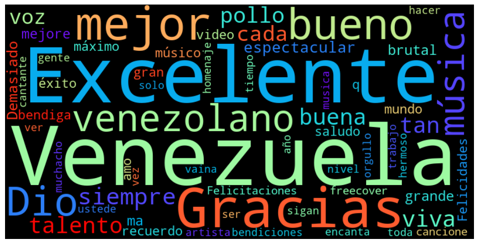
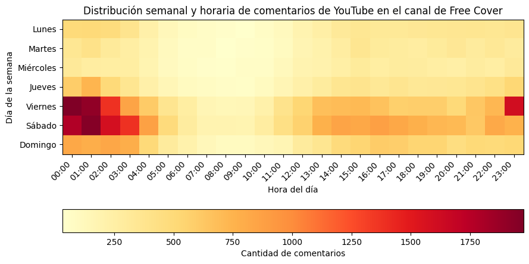

# Free Cover Project

Este repositorio contiene un Jupyter Notebook que se enfoca en el análisis de los comentarios de los videos del canal "Free Cover" en YouTube.

## Objetivo del proyecto

El objetivo de este proyecto es analizar los comentarios de los videos del canal "Free Cover" en YouTube para obtener información valiosa que ayude a entender mejor la interacción de la audiencia en la sección de comentarios de Youtube.

Para este proyecto, se utilizaron las siguientes librerías de Python:

   * Pandas: para el manejo y análisis de datos.
   * Matplotlib: para la creación de gráficas y visualizaciones.
   * Seaborn: para mejorar la estética de las gráficas y visualizaciones.
   * Google API: para extraer los comentarios de los videos de YouTube.

## Los datos

Los datos utilizados en el proyecto son los comentarios publicados por las personas en los videos del canal de Youtube de __Free Cover__, los cuales fueron extraidos utilizando la API de Google para este propósito.

Son poco más de 70 mil comentarios sin filtrar los que fueron extraídos, y los que utilizaremos.

Para utilizar el script de extracción de los comentarios simplemente se ejecuta el archivo:

    free_cover_comments.py

Lo único que hay que tener en cuenta es que se debe tener una cuenta en la API de Google, y contar con sus credenciales. Puedes obtener ayuda de como obtenerla con el siguiente enlace:

[Página de solicitud credenciales de Google](https://developers.google.com/youtube/registering_an_application?hl=es)

## Contenido del proyecto

El proyecto consiste en un Jupyter Notebook que contiene varias visualizaciones de los comentarios de los videos del canal "Free Cover" en YouTube. A continuación, se muestra un ejemplo de una de las visualizaciones:

Esta visualización muestra un mapa de calor que representa la cantidad de comentarios que se recibieron por fecha y hora del día. El eje horizontal representa las horas del día, mientras que el eje vertical representa las fechas. Los colores más oscuros indican una mayor cantidad de comentarios.

## Proceso de Fine-Tuning

Al interactuar con los datos obtenidos, y pasarlos por un analisis de sentimientos utilizando un modelo pre-entrenado para ello, vimos que muchos comentarios con modismos "marabinos" eran clasificados como negativos, cuando claramente tenían como objetivo elogiar el contenido, por lo que decidí realizar una pequeña rutina de sintonía fina al modelo. Para más detalles sobre este procedimiento puedes consultar los notebooks. 

El proceso de fine-tuning implica ajustar un modelo preentrenado utilizando datos específicos de la tarea que se desea abordar. En este repositorio, se utiliza un enfoque basado en las valiosas herramientas de  🤗HuggingFace🤗, que aprovecha la arquitectura de "transformers" y las capacidades de transferencia de aprendizaje de dichos modelos.

## Uso de Colab para aprovechar el GPU

Este repositorio incluye un notebook de Colab que aprovecha el entorno de ejecución en la nube de Google Colab, el cual ofrece acceso a GPU de forma gratuita. Utilizar GPU acelera significativamente el proceso de "fine-tuning", especialmente en conjuntos de datos grandes y modelos complejos.

## Conclusiones

En el proyecto se pudieron obtener algunas conclusiones interesantes sobre los comentarios de los videos del canal "Free Cover". Se encontró que los días de la semana con mayor cantidad de comentarios son los fines de semana, y que los horarios con mayor cantidad de comentarios son a partir de las 11:00 pm.

## Archivos con comentarios

Para una reproducción de los resultados más rápida, he dejado una carpeta con los archivos MS Excel que contienen los datos utilizados en este proyecto.

## ¿Quienes son Free Cover?

Son un grupo de jóvenes que crearon un canal de Youtube cuyo contenido son mini conciertos grabados con un estilo irreverente, auténtico, y contagioso. Comenzaron con un formato en el que ellos mismos hacían "covers" de ciertos artistas, para luego dar paso a un formato en el que invitan a los propios artiastas que interpretan los éxitos, los que los catapulto a la fama, tanto nacionalmente (Venezuela), como internacionalmente (EEUU, América Latina, y el Caribe).

Su canal de Youtube está en el siguiente enlace:

[Free Cover Venezuela](https://www.youtube.com/@FreeCoverVenezuela)
